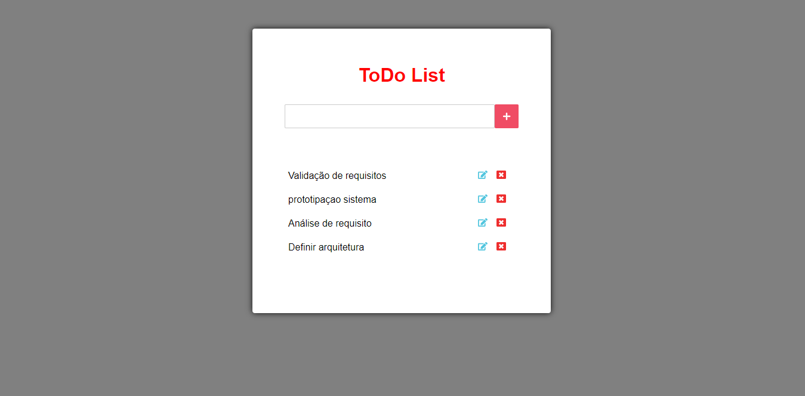

<h3 align="center">
    <b>ToDo List com React</b>
    <br>
</h3>


- [Sobre](#sobre)
- [Tecnologias Utilizadas](#tecnologias-utilizadas)
- [Como Usar](#como-usar)
- [Como Contribuir](#como-contribuir)

<a id="sobre"></a>


## :bookmark: Sobre

O <strong>ToDo list</strong> é uma aplicação que tem as funções basica de um Crud, permite listar, inserir, editar, deletar com o imcremento de salvar os items da lista no localStorage do navegador.


<a id="tecnologias-utilizadas"></a>

## :rocket: Tecnologias Utilizadas

O projeto foi desenvolvido utilizando as seguintes tecnologias


- [React](https://nodejs.org/en/)


## :heavy_check_mark: :computer: Resultado Web

<h1 align="center">
    

</h1>


<a id="como-usar"></a>

## :fire: Como usar

- ### **Pré-requisitos**

  - É **necessário** possuir o **[Node.js](https://nodejs.org/en/)** instalado na máquina
  - Também, é **preciso** ter um gerenciador de pacotes seja o **[NPM](https://www.npmjs.com/)** ou **[Yarn](https://yarnpkg.com/)**.


1. Faça um clone :

```sh
  git clone https://github.com/Rafael-Rufino/ToDo-List-React.git
```

2. Executando a Aplicação:

```sh
  # Instale as dependências
  $ npm install
  # or
  $ yarn install


  # Inicie a aplicação web
  $ cd Projeto
  $ npm run start
  # or
  $ yarn start


  # Acessar o Servidor no Navegador
  # Cliente
  $ http://localhost:3000/


```


## :recycle: Como contribuir

- Faça um Fork desse repositório,
- Crie uma branch com a sua feature: `git checkout -b my-feature`
- Commit suas mudanças: `git commit -m 'feat: My new feature'`
- Push a sua branch: `git push origin my-feature`


🎓 **Quem ministrou?**

As aulas foram ministradas pelo mestre Otávio Miranda - Instructor - Curso javaScript e TypeScript do básico ao avançado 2021.


<h4 align="center">
    Feito com 💜 by <a href="https://www.linkedin.com/in/rafael-r-dos-santos-b889311ba/" target="_blank">Rafael Rufino</a>
</h4>


